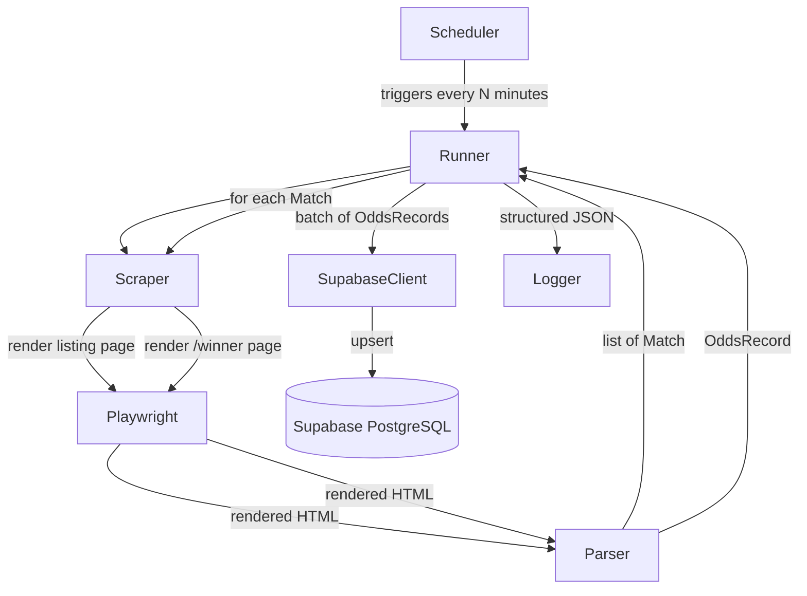

# Design Document: oddschecker-scraper

## Overview

A Python backend service that periodically scrapes Premier League match odds from OddsChecker and persists best-available odds snapshots to Supabase. OddsChecker is a React SPA, so Playwright (headless Chromium) is used to fully render pages before DOM extraction.

The system follows a two-step scrape pattern per run:
1. Render the Premier League listing page → discover all fixtures and their per-match URLs
2. For each fixture, render its `/winner` odds page → extract and derive best odds

Only best odds (max decimal value per selection across all bookmakers) are stored — no per-bookmaker rows. A single batch insert per run writes all valid `OddsRecord` objects to Supabase.

---

## Architecture



### Component Responsibilities

| Component | Responsibility |
|---|---|
| `Scheduler` | Triggers runs at a configurable interval; prevents concurrent runs |
| `Runner` | Orchestrates a single end-to-end run; owns error handling and logging summary |
| `Scraper` | Manages Playwright browser lifecycle; renders pages with stealth config |
| `Parser` | Extracts and validates `Match` and `OddsRecord` objects from rendered HTML |
| `SupabaseClient` | Wraps `supabase-py`; performs batch inserts with one retry |
| `Logger` | Configures structured JSON logging; used by all components |

---

## Components and Interfaces

### Scraper

Owns the Playwright browser context. Exposes two methods:

```python
async def fetch_listing_page() -> str:
    """Render the Premier League listing page; return full HTML."""

async def fetch_odds_page(url: str) -> str:
    """Render a match /winner odds page; return full HTML."""
```

Both methods:
- Apply a configurable inter-request delay (default 2 s) before each render
- Enforce a configurable page-load timeout (default 15 s)
- Detect Cloudflare challenge / HTTP 429 / 503 → wait 30 s and retry once
- Raise `ScraperError` on unrecoverable failure

Stealth configuration:
- `playwright-stealth` applied to every page context
- Realistic `User-Agent` string (non-headless Chrome on Windows)
- `Accept-Language`, `Accept-Encoding`, and other standard headers set
- `--disable-blink-features=AutomationControlled` launch arg

### Parser

Stateless functions operating on raw HTML strings:

```python
def parse_listing_page(html: str) -> list[Match]:
    """Extract Match objects from the listing page HTML."""

def parse_odds_page(html: str, match: Match) -> OddsRecord | None:
    """Extract and validate an OddsRecord from a /winner page HTML."""
```

`parse_odds_page` returns `None` (and logs) if:
- No bookmaker odds rows are found
- Any required field is missing
- Any best-odds value is ≤ 1.0

### SupabaseClient

```python
class SupabaseClient:
    def insert_odds_records(self, records: list[OddsRecord]) -> None:
        """Batch insert; retries once on failure; raises on second failure."""
```

Credentials sourced exclusively from environment variables (`SUPABASE_URL`, `SUPABASE_SERVICE_ROLE_KEY`).

### Scheduler

Uses **APScheduler** (`BlockingScheduler` with `IntervalTrigger`). A `threading.Event` flag prevents concurrent runs. Logs run start/end times and skips if a run is already in progress.

### Logger

Configured once at startup via `python-json-logger`. All components receive a standard `logging.Logger`. Log level controlled by `LOG_LEVEL` env var (default `INFO`).

---

## Data Models

```python
from dataclasses import dataclass
from datetime import datetime
from uuid import UUID

@dataclass
class Match:
    match_id: UUID          # auto-generated at parse time
    home_team: str
    away_team: str
    kickoff_at: datetime    # UTC
    odds_page_url: str      # full URL to /winner page

@dataclass
class OddsRecord:
    match_id: UUID
    home_team: str
    away_team: str
    kickoff_at: datetime    # UTC
    market: str             # e.g. "Match Result"
    best_home_odds: float   # max across bookmakers, > 1.0
    best_draw_odds: float
    best_away_odds: float
    fetched_at: datetime    # UTC timestamp of page render

    def to_dict(self) -> dict:
        """Serialise to a JSON-compatible dict (for Supabase insert and pretty-printing)."""

    @classmethod
    def from_dict(cls, data: dict) -> "OddsRecord":
        """Deserialise from a dict produced by to_dict()."""
```

### Supabase Schema (SQL Migration)

File: `supabase/migrations/<timestamp>_create_odds_records.sql`

```sql
create table if not exists odds_records (
    id            bigserial primary key,
    match_id      uuid        not null,
    home_team     text        not null,
    away_team     text        not null,
    kickoff_at    timestamptz not null,
    market        text        not null default 'Match Result',
    best_home_odds numeric(6,3) not null check (best_home_odds > 1.0),
    best_draw_odds numeric(6,3) not null check (best_draw_odds > 1.0),
    best_away_odds numeric(6,3) not null check (best_away_odds > 1.0),
    fetched_at    timestamptz not null default now(),
    created_at    timestamptz not null default now()
);

-- Index for common query patterns
create index if not exists idx_odds_records_match_id   on odds_records (match_id);
create index if not exists idx_odds_records_kickoff_at on odds_records (kickoff_at desc);
create index if not exists idx_odds_records_fetched_at on odds_records (fetched_at desc);
```

No unique constraint on `match_id` — multiple snapshots per match across runs are intentional.

---

## Project Structure

```
oddschecker-scraper/
├── src/
│   ├── scraper.py          # Playwright page rendering + stealth
│   ├── parser.py           # HTML → Match / OddsRecord
│   ├── models.py           # Match, OddsRecord dataclasses
│   ├── supabase_client.py  # Supabase batch insert
│   ├── scheduler.py        # APScheduler wrapper
│   ├── runner.py           # Single-run orchestration
│   └── logger.py           # JSON logging setup
├── supabase/
│   └── migrations/
│       └── <timestamp>_create_odds_records.sql
├── tests/
│   ├── test_parser.py
│   ├── test_models.py
│   └── test_supabase_client.py
├── .env.example
├── Dockerfile
├── main.py                 # Entry point
└── requirements.txt
```

---

## Container Deployment

The service ships as a single Docker image. The base image is `mcr.microsoft.com/playwright/python:v1.44.0-jammy`, which bundles Chromium and all required system-level dependencies — no separate `playwright install` step is needed.

### Dockerfile

```dockerfile
FROM mcr.microsoft.com/playwright/python:v1.44.0-jammy

WORKDIR /app

COPY requirements.txt .
RUN pip install --no-cache-dir -r requirements.txt

COPY src/ src/
COPY main.py .

CMD ["python", "main.py"]
```

### Environment Variables at Runtime

No secrets are baked into the image. Pass them at runtime:

```bash
# Local / Docker CLI
docker run --env-file .env oddschecker-scraper

# Or individual vars
docker run \
  -e SUPABASE_URL=... \
  -e SUPABASE_SERVICE_ROLE_KEY=... \
  oddschecker-scraper
```

On managed platforms (Railway, Render, ECS, Cloud Run) set the variables through the platform's environment config UI or secrets manager.

### Deployment Targets

Any Docker-capable host works:

| Platform | Notes |
|---|---|
| Railway / Render | Push image or connect repo; set env vars in dashboard |
| AWS EC2 / ECS | Standard container deployment; use ECS task definition env vars or Secrets Manager |
| GCP Cloud Run | Set `--min-instances=1` — the scheduler is a long-running process, not request-driven, so the container must stay alive between scrape intervals |

---

## Environment Variables / Configuration

| Variable | Default | Description |
|---|---|---|
| `SUPABASE_URL` | — (required) | Supabase project URL |
| `SUPABASE_SERVICE_ROLE_KEY` | — (required) | Supabase service role key |
| `POLL_INTERVAL_MINUTES` | `10` | Scheduler interval in minutes |
| `PAGE_DELAY_SECONDS` | `2` | Delay between consecutive page renders |
| `PAGE_TIMEOUT_SECONDS` | `15` | Playwright page-load timeout |
| `LOG_LEVEL` | `INFO` | Logging level (DEBUG/INFO/WARNING/ERROR) |

All configuration is read at startup via `python-dotenv` from a `.env` file (not committed) or from the process environment.

---

## Error Handling

| Scenario | Behaviour |
|---|---|
| Listing page render fails | Log error, abort run, exit non-zero |
| No matches found on listing page | Log warning, abort run (no DB write) |
| Individual match odds page fails | Log match + reason, skip match, continue |
| No bookmaker odds extracted | Log warning for match, skip, continue |
| OddsRecord validation failure | Log discarded field/value, skip record |
| Supabase insert fails | Log error, retry once after 5 s |
| Supabase retry fails | Log final error, exit non-zero |
| Cloudflare / 429 / 503 | Wait 30 s, retry once; treat second failure as page failure |
| Page-load timeout | Treat as failed render |
| Concurrent run attempted | Log warning, skip trigger |

---


## Correctness Properties

*A property is a characteristic or behavior that should hold true across all valid executions of a system — essentially, a formal statement about what the system should do. Properties serve as the bridge between human-readable specifications and machine-verifiable correctness guarantees.*

### Property 1: Parser extracts all required Match fields

*For any* rendered listing-page HTML that contains match rows, every `Match` object returned by `parse_listing_page` must contain non-empty values for `home_team`, `away_team`, `kickoff_at`, `odds_page_url`, and a valid UUID `match_id`.

**Validates: Requirements 1.2**

---

### Property 2: Best odds equal the maximum across bookmakers

*For any* list of bookmaker odds rows (each with home, draw, away decimal values), the derived `best_home_odds`, `best_draw_odds`, and `best_away_odds` must each equal the maximum value in the corresponding column across all rows.

**Validates: Requirements 2.3**

---

### Property 3: Parser extracts all required OddsRecord fields

*For any* rendered odds-page HTML that contains bookmaker odds, the `OddsRecord` returned by `parse_odds_page` must contain non-None values for all required fields: `match_id`, `home_team`, `away_team`, `kickoff_at`, `market`, `best_home_odds`, `best_draw_odds`, `best_away_odds`, and `fetched_at`.

**Validates: Requirements 3.1**

---

### Property 4: Validation rejects invalid OddsRecords

*For any* `OddsRecord` dict that is missing at least one required field, or where any best-odds value is ≤ 1.0 (including zero, negative numbers, or exactly 1.0), `OddsRecord.from_dict` (or the parser validation step) must reject the record and not produce a valid `OddsRecord`.

**Validates: Requirements 3.2, 3.3**

---

### Property 5: OddsRecord serialisation round-trip

*For any* valid `OddsRecord` object, calling `to_dict()` and then `OddsRecord.from_dict()` on the result must produce an object equivalent to the original (all fields equal).

**Validates: Requirements 3.4, 3.5**

---

### Property 6: Insert payload contains all required columns

*For any* valid `OddsRecord`, the dict produced by `to_dict()` (which is passed to the Supabase insert) must contain all required column keys: `match_id`, `home_team`, `away_team`, `kickoff_at`, `market`, `best_home_odds`, `best_draw_odds`, `best_away_odds`, `fetched_at`.

**Validates: Requirements 4.2**

---

### Property 7: All log output is valid JSON

*For any* scraper event that triggers a log call, the emitted log line must be parseable as valid JSON (i.e., `json.loads(line)` must not raise).

**Validates: Requirements 7.1**

---

## Testing Strategy

### Dual Testing Approach

Both unit tests and property-based tests are required and complementary:

- **Unit tests** cover specific examples, integration points, and error-handling edge cases
- **Property tests** verify universal correctness across randomly generated inputs

### Property-Based Testing

Library: **[Hypothesis](https://hypothesis.readthedocs.io/)** (Python)

Each property from the Correctness Properties section maps to exactly one Hypothesis test. Tests are configured with `@settings(max_examples=100)` minimum.

Tag format in test comments: `# Feature: oddschecker-scraper, Property {N}: {property_text}`

| Property | Test file | Hypothesis strategy |
|---|---|---|
| P1: Parser extracts all Match fields | `tests/test_parser.py` | Generate synthetic listing-page HTML with random team names, dates, URLs |
| P2: Best odds = max across bookmakers | `tests/test_parser.py` | Generate lists of `(home, draw, away)` float tuples > 1.0 |
| P3: Parser extracts all OddsRecord fields | `tests/test_parser.py` | Generate synthetic odds-page HTML with random bookmaker rows |
| P4: Validation rejects invalid records | `tests/test_models.py` | Generate dicts with missing fields or odds ≤ 1.0 |
| P5: OddsRecord round-trip | `tests/test_models.py` | Generate valid `OddsRecord` instances via `st.builds` |
| P6: Insert payload has all columns | `tests/test_models.py` | Generate valid `OddsRecord` instances via `st.builds` |
| P7: All log output is valid JSON | `tests/test_logger.py` | Generate random event dicts and log them |

### Unit Tests

Focus areas:
- **Error handling**: listing page failure aborts run; match page failure skips match; Supabase retry logic
- **Edge cases**: empty match list, no bookmaker rows, exactly 1.0 odds boundary
- **Scheduler**: concurrent run prevention, default interval fallback
- **Configuration**: env var defaults, missing required env vars raise at startup

### Test Isolation

- Playwright is never invoked in unit/property tests — `Scraper` is mocked to return fixture HTML strings
- Supabase client is mocked — no live DB calls in tests
- `time.sleep` is patched to avoid slow tests
